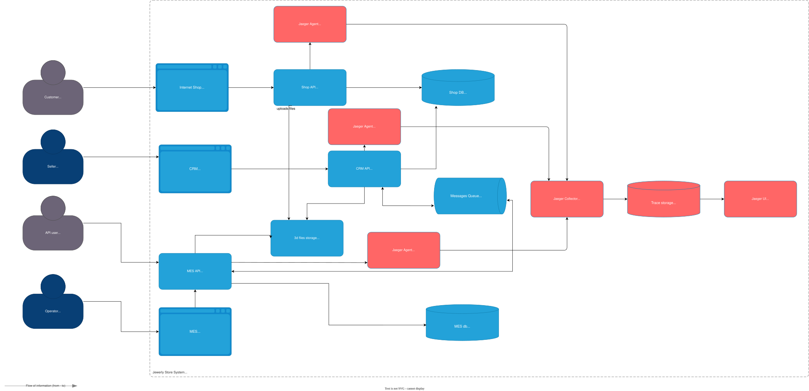

# Архитектурное решение по трейсингу

## Критические зоны

На основе анализа системы и C4-диаграммы были идентифицированы следующие места, где заказ может «сломаться» или зависнуть:

### 1. Очередь сообщений RabbitMQ
Это центральный элемент интеграции между CRM и MES. Именно здесь наиболее вероятна потеря сообщений:
- CRM отправляет сообщение о новом заказе в очередь → MES должен его получить и начать обработку
- Если сообщение потеряется или не будет обработано, заказ «зависнет» без статуса PRICE_CALCULATED
- Очередь может накапливать сообщения при высокой нагрузке, что приводит к задержкам

### 2. Процесс расчёта стоимости (MES API)
- Расчёт занимает от 2 до 30 минут в зависимости от сложности 3D-модели
- Заказ может «зависнуть» в статусе FILE_UPLOADED, если сообщение не дошло до MES
- При сложных моделях длительное ожидание создаёт неопределённость для клиента

### 3. Межсервисное взаимодействие (Shop API ↔ CRM API)
- Shop API создаёт заказ в CRM API после нажатия кнопки «Сделать заказ»
- Если CRM API недоступна или не обработала запрос, заказ останется в статусе SUBMITTED
- Нет возможности отследить, где именно произошла проблема

### 4. Внешнее API (B2B-партнёры)
- При создании заказа через API пользователя заказ попадает в MES, затем через очередь в CRM
- Потеря сообщения приведёт к тому, что B2B-партнёр получит заказ, но в системе «Александрита» его не будет
- Жалобы от API-пользователей являются одной из текущих проблем компании

### Данные для трейсинга

Для полноценного отслеживания заказа необходимо фиксировать:
- **trace_id**: уникальный идентификатор всего пути заказа
- **span_id**: идентификатор отдельной операции
- **order_id**: идентификатор заказа
- **customer_id**: идентификатор клиента (для B2C и B2B)
- **current_status**: текущий статус заказа
- **timestamp**: время события
- **message_id**: идентификатор сообщения в RabbitMQ
- **error_message**: текст ошибки при сбое

## Мотивация

### Зачем нужен трейсинг

В текущей ситуации компания сталкивается со следующими проблемами:

1. **Клиенты не знают, где их заказ** - жалобы на заказы, которые «работают уже несколько месяцев»
2. **Поддержка не может найти проблему** - разбор каждого инцидента занимает «очень много времени»
3. **Жалобы от B2B-партнёров** - компании ежедневно сообщают, что не получили свои заказы, но нет данных для расследования

### Что даст внедрение трейсинга

Внедрение трейсинга позволит отслеживать полный путь заказа через все системы и выявлять проблемные места в режиме реального времени.

### Технические и бизнес-метрики

**Технические метрики:**

1. **Среднее время обнаружения проблемы (MTTR - Mean Time To Recovery)**
   - Сейчас: несколько дней на разбор одного инцидента
   - После внедрения: минуты благодаря визуализации trace
   - Влияние: сокращение времени простоя системы

2. **Скорость исправления багов**
   - Сейчас: проблему ищут «со слов клиента»
   - После внедрения: видно точное место сбоя в трейсах
   - Влияние: ускорение разработки и меньше регрессов

3. **Процент успешно завершённых заказов**
   - Сейчас: нет метрики, проблемы выявляются только по жалобам
   - После внедрения: можно отслеживать зависшие заказы
   - Влияние: повышение качества сервиса

4. **Время обработки заказа на каждом этапе**
   - Сейчас: нет данных о том, где задержка
   - После внедрения: видно время на каждом span
   - Влияние: оптимизация процессов

**Бизнес-метрики:**

5. **Количество жалоб на «потерянные» заказы**
   - Сейчас: растёт пропорционально нагрузке
   - После внедрения: можно оперативно находить и исправлять
   - Влияние: удовлетворённость клиентов, сохранение контрактов

## Предлагаемое решение

### Выбор технологии

Для реализации трейсинга рекомендуется использовать **Jaeger** - решение с открытым исходным кодом, построенное на стандарте OpenTelemetry. Альтернатива - Zipkin, но Jaeger предоставляет более современный интерфейс и лучше масштабируется.

### Компоненты для внедрения

1. **Jaeger Collector** - сервис для сбора трейсов от всех приложений
2. **Jaeger Query (UI)** - веб-интерфейс для просмотра трейсов
3. **Jaeger Agent** - агент, устанавливаемый рядом с каждым приложением для отправки данных
4. **Instrumentation** - доработка кода приложений для генерации trace/spans

### Какие компоненты нужно доработать

| Компонент | Доработка | Приоритет |
|-----------|-----------|-----------|
| Shop API (Spring Boot) | Добавить OpenTelemetry agent, генерация trace_id при создании заказа | Высокий |
| CRM API (Spring Boot) | Интеграция с RabbitMQ для пробрасывания trace_id в сообщениях | Высокий |
| MES API (C#) | Добавить OpenTelemetry SDK для .NET, генерация spans на каждом этапе | Высокий |
| RabbitMQ | Настроить пробрасывания trace_id через заголови сообщения | Высокий |

### Доработка C4-диаграммы

Ниже представлена обновлённая диаграмма контейнеров с добавленными компонентами трейсинга (выделены красным):

[Ссылка на диаграмму: jewerly_c4_model_tracing.drawio](jewerly_c4_model_tracing.drawio)

### Описание новых компонентов на схеме

1. **Jaeger Collector** - центральный компонент сбора трейсов
   - Технология: Go
   - Расположение: изолированный инстанс или в Docker-кластере
   - Порт: 14268 (HTTP), 14250 (gRPC от агентов)

2. **Jaeger Query** - UI для аналитиков и разработчиков
   - Технология: React
   - Расположение: вместе с Collector
   - Порт: 16686

3. **Агенты Jaeger** - агенты рядом с каждым приложением
   - Расположение: на тех же инстансах, что и приложения
   - Функция: буферизация и отправка спанов в Collector

### Как это работает

1. При создании заказа в Shop API генерируется уникальный **trace_id**
2. При отправке сообщения в RabbitMQ **trace_id** передаётся в заголовки сообщения
3. При получении сообщения MES API продолжает тот же **trace**, добавляя спаны
4. Все спаны собираются агентами и отправляются в Jaeger Collector
5. Команда может найти заказ по **order_id** и увидеть полный путь через все системы

## Компромиссы

### Когда трейсинг не принесёт пользы

1. **Проприетарные внешние системы**
   - Внешние транспортные компании, с которыми интеграция через ограниченные API
   - Нет возможности добавить "instrumentation" без доработки на стороне партнёра
   - Решение: логировать только факт передачи заказа внешней системе

2. **3D-файлы и хранилище S3**
   - Загрузка и хранение файлов - это простая загрузка, не влияющая на бизнес-логику
   - Трейсинг здесь не поможет найти проблему с заказом
   - Решение: не включать в трейсинг операции с S3

3. **Статические веб-интерфейсы**
   - CRM (Vue), MES (React), Internet Shop (Vue) - фронтенд не участвует в бизнес-логике
   - Трейсинг на фронтенде нужен только для UX, не для проблем с заказами
   - Решение: трейсинг только на бэкенде

### Когда реализация слишком дорога

1. **MES с исходным кодом**
   - Система куплена вместе с исходным кодом, но есть риск сложности интеграции с .NET
   - Если OpenTelemetry SDK для .NET несовместим с версией MES, потребуется ручная доработка
   - Решение: начать с Java-приложений (Shop API, CRM API), затем оценить сложность MES

2. **Высокие требования к ресурсам**
   - При высокой нагрузке (100+ заказов в месяц) объём трейсов может быть значительным
   - Требуется оценка ресурсов для хранилища или вычислений для Jaeger
   - Решение: настроить sampling (отправлять 10-20% трейсов)

## Безопасность

### Авторизация

| Окружение | Доступ | Пользователи |
|-----------|--------|--------------|
| Dev | Все сотрудники с корпоративной учётной записью | Разработчики, QA, DevOps |
| Release | Все сотрудники с корпоративной учётной записью | Разработчики, QA, DevOps |
| Prod | Ограниченный доступ | Тимлид, старшие бэкенд-разработчики |

### Защита от внешнего доступа

- **Dev/Release/Prod**: доступ через VPN или корпоративную сеть, доступен только для технических специалистов
- **Внешние API**: Jaeger UI недоступен из интернета, только через внутреннюю сеть

### Чувствительные данные в трейсах

При внедрении необходимо убедиться, что в трейсах не передаются:
- Пароли и токены авторизации
- Номера банковских карт
- Персональные данные клиентов

Рекомендуется настроить чистку всех заголовков и тел в сообщениях RabbitMQ перед отправкой в Jaeger.
Чистку может, например, реализован через токенизацию конфиденциальных данных.