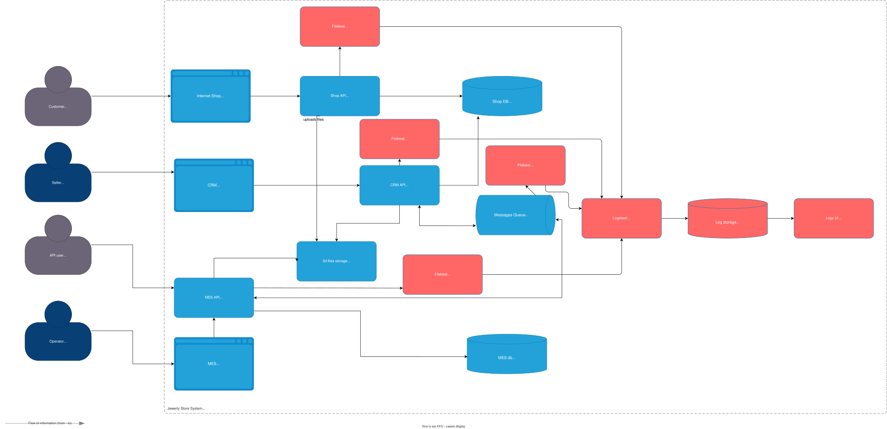

# Архитектурное решение по логированию

## Анализ системы и требования к логированию

### Системы для сбора логов

На основе анализа архитектуры «Александрит» необходимо собирать логи из следующих систем:

| Система | Технология | Приоритет |
|---------|------------|-----------|
| Онлайн-магазин (Shop API) | Java Spring Boot | Высокий |
| CRM (CRM API) | Java Spring Boot | Высокий |
| MES (MES API) | C# | Высокий |
| RabbitMQ | Message broker | Средний |

### События для логирования (уровень INFO)

Для полноценного понимания происходящего в системе необходимо логировать следующие события:

**Заказы:**
- Создание заказа (время, ID заказа, ID клиента, статус)
- Изменение статуса заказа (время, ID заказа, старый статус, новый статус, инициатор)
- Отмена заказа (время, ID заказа, причина отмены)

**Аутентификация и авторизация:**
- Успешный вход пользователя (время, ID пользователя, тип пользователя: клиент/оператор/менеджер)
- Неудачная попытка входа (время, ID пользователя или email, причина)
- Выход из системы (время, ID пользователя)

**Очереди сообщений:**
- Отправка сообщения в RabbitMQ (время, queue name, message ID, order ID)
- Получение сообщения из RabbitMQ (время, queue name, message ID, order ID)
- Ошибка обработки сообщения (время, queue name, message ID, ошибка)

**Расчёт стоимости:**
- Начало расчёта стоимости (время, ID заказа, количество полигонов)
- Завершение расчёта стоимости (время, ID заказа, итоговая стоимость, время выполнения)
- Ошибка расчёта стоимости (время, ID заказа, причина ошибки)

### Уровни логирования

| Уровень | Когда использовать |
|---------|-------------------|
| DEBUG | Подробная информация для отладки в dev-окружении |
| INFO | Бизнес-события: создание заказа, изменение статуса, аутентификация |
| WARN | Медленные операции (>5 сек), неожиданные ситуации, которые не блокируют работу |
| ERROR | Исключения, ошибки обработки заказов, сбои интеграций |

Уровень DEBUG использовать только в dev-окружении. В production логировать только INFO и выше.

## Мотивация

### Зачем нужно логирование

В текущей ситуации компания сталкивается со следующими проблемами:

1. **Разбор инцидентов занимает слишком много времени** - «ошибки или нестандартные ситуации разбираются со слов клиента»
2. **Невозможно воспроизвести проблему** - разработчики не видят, что происходило на стороне сервиса
3. **Рост нагрузки на поддержку** - клиенты звонят и жалуются, менеджеры тратят время на разбор
4. **Потеря контрактов** - из-за проблем с заказами компания уже потеряла несколько крупных контрактов
5. **Нет данных для анализа** - невозможно понять, где именно система дала сбой

### Технические и бизнес-метрики

**Технические метрики:**
1. **Среднее время решения инцидента (MTTR)**
   - Сейчас: несколько дней на разбор одного инцидента
   - После внедрения: минуты благодаря поиску по логам
   - Влияние: сокращение времени простоя и уменьшение количества эскалаций
2. **Количество обращений в поддержку по техническим проблемам**
   - Сейчас: растёт пропорционально нагрузке
   - После внедрения: команда может быстро находить и исправлять проблемы
   - Влияние: снижение нагрузки на поддержку
3. **Процент успешно обработанных заказов**
   - Сейчас: нет метрики, проблемы выявляются только по жалобам
   - После внедрения: можно отслеживать зависшие заказы по логам
   - Влияние: повышение качества сервиса
4. **Время обнаружения деградации системы**
   - Сейчас: проблемы обнаруживаются через обращения клиентов
   - После внедрения: алерты срабатывают при первых признаках проблем
   - Влияние: проактивное обнаружение проблем

**Бизнес-метрики:**
5. **Удовлетворённость клиентов**
   - Сейчас: клиенты не могут получить информацию о своих заказах
   - После внедрения: поддержка может быстро помочь клиентам
   - Влияние: удержание клиентов и контрактов

## Приоритеты внедрения

### Список систем с приоритетами

Команда не сможет реализовать единовременно логирование всех систем. Приоритеты основаны на текущих проблемах компании:

| Приоритет | Система | Обоснование |
|-----------|---------|-------------|
| 1 | MES API | Больше всего жалоб от клиентов на «потерянные» заказы |
| 2 | Shop API | B2C-клиенты - основной источник выручки |
| 3 | CRM API | Операторы и продавцы - влияют на скорость обработки |
| 4 | RabbitMQ | Интеграционные проблемы - один из источников потерянных заказов |

### План внедрения

**Этап 1 (2 недели):** MES API
- Внедрить структурированное логирование
- Настроить отправку логов в централизованную систему
- Определить ключевые события для логирования

**Этап 2 (2 недели):** Shop API
- Аналогично MES API
- Сфокусироваться на событиях создания заказов и статусах

**Этап 3 (1 неделя):** CRM API
- Логирование операций менеджеров
- События изменения статусов заказов

**Этап 4 (1 неделя):** RabbitMQ
- Логирование отправки и получения сообщений
- Связь message_id с order_id

## Предлагаемое решение

### Выбор технологии

Рекомендуется использовать **ELK-стек (Elasticsearch, Logstash, Kibana)** - проверенное решение для централизованного логирования.
Альтернативы:
- **Loki + Promtail** - легче, дешевле, но менее функционален для полнотекстового поиска
- **Splunk** - платный, дорогой, избыточен для текущих задач

### Компоненты для внедрения

| Компонент | Назначение | Технология |
|-----------|-----------|------------|
| Beats (Filebeat) | Сбор логов с каждого сервиса | Go |
| Logstash | Обработка, парсинг, обогащение логов | Java |
| Elasticsearch | Хранение и поиск логов | Java |
| Kibana | Визуализация и анализ логов | JavaScript |

### Какие компоненты нужно доработать

| Компонент | Доработка | Приоритет |
|-----------|-----------|-----------|
| Shop API (Spring Boot) | Добавить `logback` с JSON-форматированием, интеграция с Filebeat | Высокий |
| CRM API (Spring Boot) | Аналогично Shop API | Высокий |
| MES API (C#) | Добавить `Serilog` с JSON-форматированием, интеграция с Filebeat | Высокий |
| RabbitMQ | Настроить Filebeat для логов RabbitMQ | Средний |

### Структура логов

Все логи должны быть в структурированном JSON-формате с обязательными полями:

```json
{
  "timestamp": "2024-01-15T10:30:00.000Z",
  "level": "INFO",
  "service": "shop-api",
  "trace_id": "abc-123-def",
  "order_id": "order-456",
  "message": "Заказ создан",
  "fields": {
    "customer_id": "cust-789",
  }
}
```

### Доработка C4-диаграммы

Ниже представлена обновлённая диаграмма контейнеров с добавленными компонентами логирования (выделены красным):



[Ссылка на диаграмму: jewerly_c4_model_logging.drawio](jewerly_c4_model_logging.drawio)

## Политика безопасности

### Работа с конфиденциальными данными

При логировании необходимо маскировать чувствительные данные:

| Тип данных | Обработка |
|------------|-----------|
| Пароли и токены | Не логировать, удалять из входящих данных |
| Номера банковских карт | Маскировать (показывать только последние 4 цифры) |
| Персональные данные (ФИО, email, телефон) | Логировать только ID, не сами данные |
| 3D-модели | Не логировать содержимое |

### Разграничение доступа

| Роль | Доступ к логам |
|------|----------------|
| Разработчики | Просмотр логов в dev и release через Kibana |
| DevOps | Полный доступ к логам всех окружений |
| Поддержка | Просмотр логов prod по конкретным заказам (только чтение) |
| Тимлид | Полный доступ |
| Бизнес-пользователи (продакты, менеджеры) | Нет доступа |

### Защита от внешнего доступа

- **Kibana** доступна только через внутреннюю сеть или VPN
- Все логи хранятся в закрытом контуре, недоступном из интернета

## Политика хранения

### Где и как хранятся логи

- **Elasticsearch** - основное хранилище логов
- **Индексы** - отдельный индекс для каждой системы: `shop-api-logs`, `crm-api-logs`, `mes-api-logs`, `rabbitmq-logs`
- **Репликация** - минимум 1 реплика для каждого индекса

### Срок хранения (retention по времени)

| Окружение | Срок хранения | Обоснование |
|-----------|---------------|-------------|
| Dev | 7 дней | Достаточно для отладки |
| Release | 14 дней | Для тестирования и разбора инцидентов |
| Prod | 30 дней | Достаточно для разбора большинства проблем |

Для долгосрочного хранения (архив) можно выгружать логи в S3 сжатыми архивами.

### Размер и объём логов (retention по размеру)

- **Ожидаемый объём:** ~50 MB в день для всех систем
- **Максимальный размер индекса:** 50 GB
- **Политика ротации:** ежедневно новый индекс, удаление старых по schedule

### Управление жизненным циклом

1. **Hot** (0-7 дней): активные логи, быстрый поиск
2. **Warm** (8-30 дней): архивные логи, медленный поиск
3. **Delete** (>30 дней): автоматическое удаление

## Анализ логов

### Алертинг

Настроить автоматические оповещения при обнаружении проблем:

**Критичные алерты (P1):**

- ERROR-уровень в логах любого сервиса - немедленное уведомление в Telegram/Slack
- Потеря сообщения в RabbitMQ (dead-letter)

**Высокие алерты (P2):**

- Множественные неудачные попытки входа для одного пользователя (возможный брутфорс)
- Резкое увеличение времени расчёта стоимости (>30 минут)

**Предупреждающие алерты (P3):**

- Медленные запросы (>5 секунд)
- Повторяющиеся WARN-уровни

### Поиск аномалий

**Аномалии для обнаружения:**
1. **Резкое увеличение количества заказов**
   - Норма: +100 заказов в месяц
   - Аномалия: +1000 заказов за час - возможный DDoS или ошибка интеграции
2. **Подозрительные изменения статусов**
   - Аномалия: один пользователь меняет статус много раз за короткое время
3. **Аномальное время обработки**
   - Аномалия: расчёт стоимости занимает >30 минут при обычных 2-3 минутах
